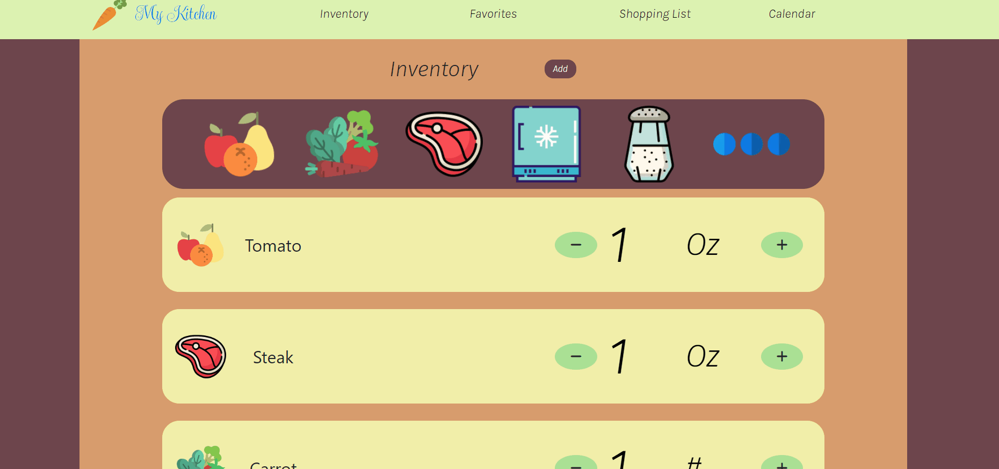

# My Kitchen

A web application for home cooks who want to efficiently use all the ingredients they buy.

I made this application for myself because cooking at home is also expensive if the ingredients aren't all used but I didn't want to make too many servings of the same food.

## Live Deployment
https://recipize-my-kitchen.herokuapp.com/

## Technologies
- React.js
- Webpack
- Bootstrap 5
- Node.js
- HTML5
- CSS3
- Heroku
- Postgresql

## Features
- User can add food item to inventory
- User can increment/decrement quantity of food item
- User can search recipes that use food items selected
- User can edit food items
- User can plan searched recipes into the calendar
- User can add food items to shopping list
- User can add shopping list item to food items
- User can favorite recipes
- User can plan favorited recipes into the calendar
- User can see recipe title and details by clicking on the recipe item
- User can see the recipe website by clicking the provided link

## GIF
 

## Stretch Features
Looking to implement Oauth and sharing recipes with other users.

## System Requirements

- Node.js 10 or higher
- NPM 6 or higher

## Getting Started
1. Clone the repository

    ```shell
    git clone https://github.com/jonathan-byun/my-kitchen
    cd my-kitchen
    ```

2. Install dependcies with NPM

    ```shell
    npm install
    ```
3. Start server

    ```shell
    sudo service postgresql start
    ```
4. Import exmaple data using db import

    ```shell
    npm run db:import
    ```
5. Start the project. View by opening http://localhost:3000

    ```shell
    npm run dev
    ```
